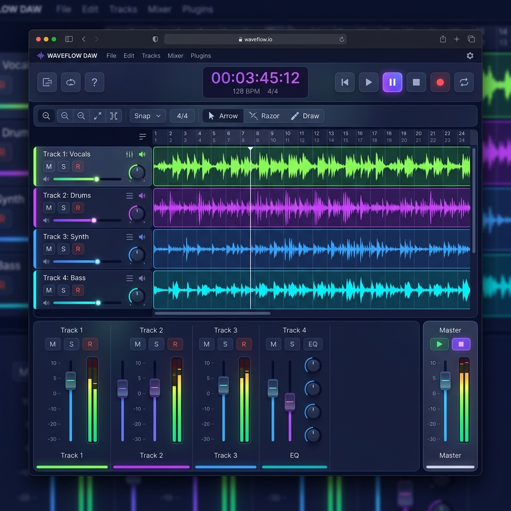
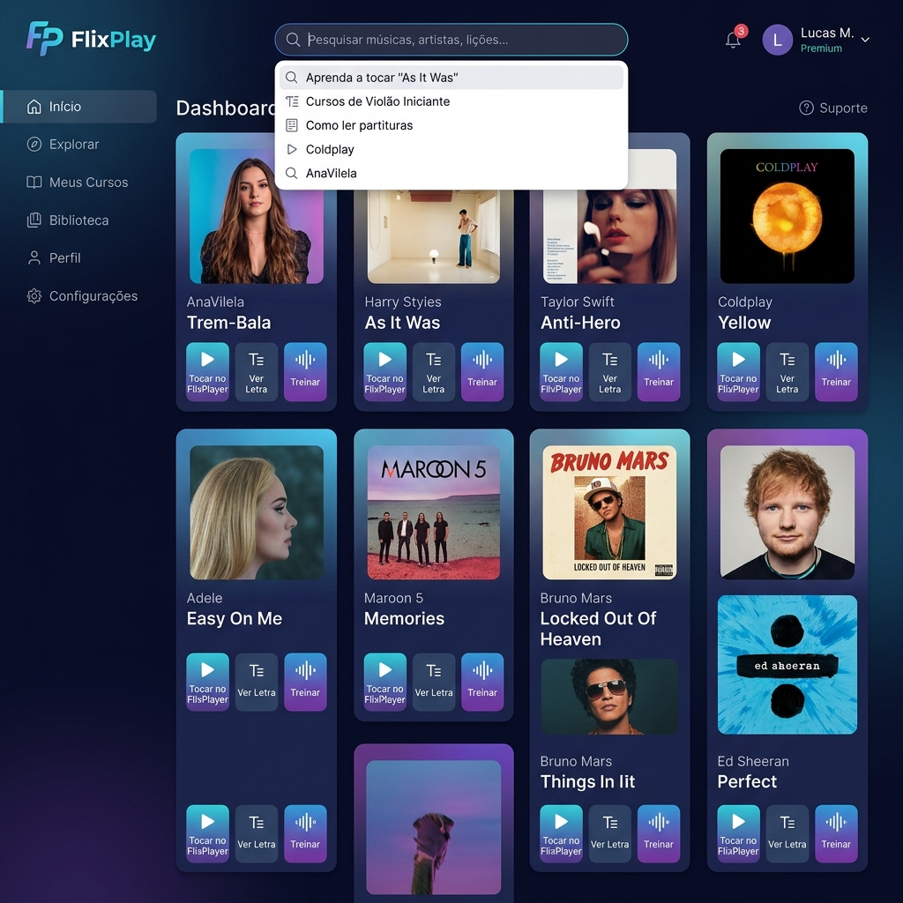

# CifrasFlix 🎵

Uma plataforma web interativa completa para músicos, combinando aprendizado de cifras, treino instrumental e ferramentas avançadas de produção musical diretamente no navegador.

---

## 📸 Screenshots

### 🎛️ Digital Audio Workstation (DAW)
Interface moderna para gravação, mixagem e controle de pistas de áudio com visualização avançada de ondas sonoras:


### 🎬 FlixPlay
Plataforma estilo streaming para busca e reprodução interativa de tablaturas e cifras em formato GuitarPro:


---

## ✨ Principais Funcionalidades

*   **🎬 FlixPlay**: Navegação inteligente e reprodutor interativo para arquivos GuitarPro (`.gp`, `.gp3`, `.gp4`, `.gp5`, `.gpx`).
*   **🎛️ DAW (Estúdio Digital)**: Estúdio completo multipista no navegador para manipulação de áudio, gravação, ajuste de volume e exportação.
*   **🎹 Treinamento Instrumental**: Módulo prático (como Piano/Teclado interativo) para exercitar músicas com feedback visual em tempo real.
*   **🎙️ Separador de Áudio**: Divisão inteligente de faixas (stems) de arquivos de áudio (separando voz, bateria, baixo, etc.).
*   **🎸 Afinador Digital**: Afinador de instrumentos com alta precisão usando o microfone do dispositivo.
*   **🔄 Conversor de Arquivos**: Conversor de formatos integrado para otimizar arquivos de áudio e cifras.

---

## 🛠️ Tecnologias Utilizadas

*   **Backend**: [Python](https://www.python.org/) com [Flask](https://flask.palletsprojects.com/)
*   **Banco de Dados**: [SQLite](https://www.sqlite.org/) (armazenamento persistente de canções, artistas e metadados)
*   **Frontend**: HTML5, Vanilla CSS (estilização premium com suporte nativo a Dark Mode/Modo Escuro) e JavaScript moderno (utilizando a Web Audio API)
*   **Formatos Suportados**: GuitarPro files, MP3, WAV e mais.

---

## 🚀 Como Executar o Projeto Localmente

1.  **Clone o repositório**:
    ```bash
    git clone https://github.com/seu-usuario/cifrasflix1.git
    cd cifrasflix1
    ```

2.  **Instale as dependências**:
    ```bash
    pip install -r requirements.txt
    ```

3.  **Execute o servidor de desenvolvimento**:
    ```bash
    python app.py
    ```

4.  **Acesse no navegador**:
    Abra `http://localhost:5000` ou a URL exibida no console.

---

## 🔧 Configurações do Git

O repositório já está configurado para o Git:
*   Os arquivos de áudio pesados, arquivos temporários de processamento e arquivos GuitarPro (`*.gp*`, `*.mp4`, `*.sf2`) estão ignorados no [`.gitignore`](.gitignore) para evitar inflar o histórico de commits.
*   O banco de dados local (`cifras.db`) está devidamente listado no gitignore.
*   Os diretórios de assets essenciais e imagens de demonstração (`screenshots/`) estão configurados para serem versionados corretamente.
